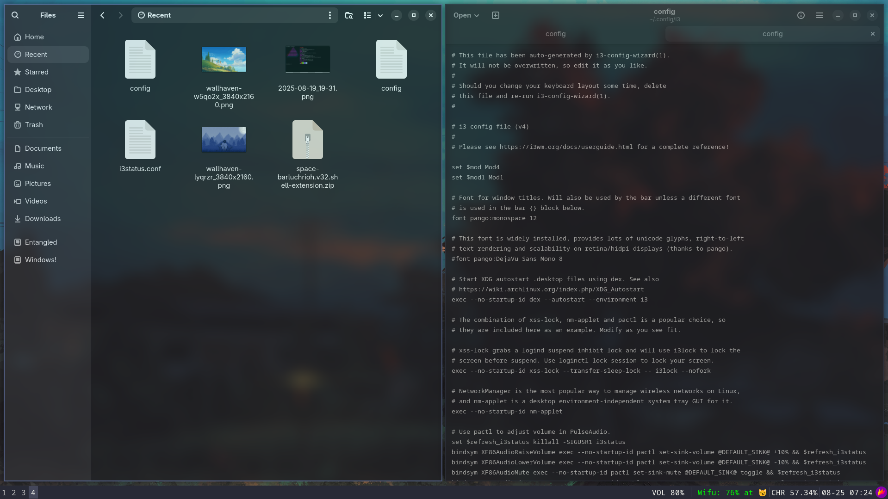

<h2 align="center"> ━━━━━━  ❖  ━━━━━━ </h2>

# <samp> Utkarsh' dotfiles </samp>

 

Here are some information about my setup: 

- Window Manager: `i3wm`
- Compositor: `picom`
- Terminal: `kitty`
- Editor: `neovim` & `vs code`
- Panel | statusbar: `i3status`
- Application Launcher: `rofi`
- File Manager: `Dolphin` or `Nautilus` (generally)
- Screenshot: `flameshot`
- wallpaper: `feh`
- Brightness Control: `brightnessctl`

## <samp>bluetooth config- </samp>

* first install `bluez` & `bluez-utils`

* `systemctl enable bluetooth.service`
* `systemctl start bluetooth.service`
* `bluetoothctl`
  - `scan on`

  - `pair mac_address`
  - `trust mac_address`
  - `connect mac_address`
  - `quit `
 
    
| <samp> Previews </samp> |       |
| --- | --- |

   

